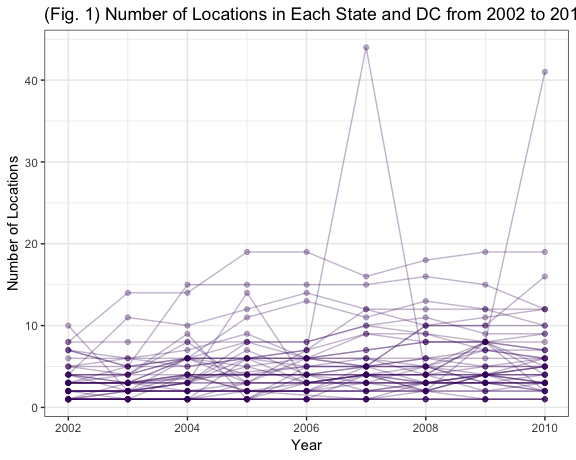

Homework 3
================
Sarah Vititoe
10/13/2018

#### Problem 1

*"This problem uses the BRFSS data. DO NOT include this dataset in your local data directory; instead, load the data from the p8105.datasets package.*

*First, do some data cleaning:*

*format the data to use appropriate variable names;* *focus on the “Overall Health” topic* *include only responses from “Excellent” to “Poor”* *organize responses as a factor taking levels ordered from “Excellent” to “Poor”"*

``` r
brfss <- p8105.datasets::brfss_smart2010 %>%
  janitor::clean_names() %>%
  filter(topic == "Overall Health") %>%
  mutate(response = as.factor(response))
```

*"Using this dataset, do or answer the following (commenting on the results of each):"* *"In 2002, which states were observed at 7 locations?"*

``` r
brfss %>% 
  select(State = locationabbr, locationdesc) %>% 
  group_by(State) %>% 
  distinct() %>% 
  tally() %>%
  filter(n == 7) %>%
  select(-n) %>%
  knitr::kable()
```

| State |
|:------|
| CT    |
| MT    |
| NH    |
| NM    |
| OR    |
| TN    |
| UT    |

*"Make a “spaghetti plot” that shows the number of locations in each state from 2002 to 2010."*

``` r
brfss %>%
  select(year, locationabbr, locationdesc) %>%
  group_by(locationabbr, year) %>% 
  distinct() %>% 
  tally %>% 
  ggplot(aes(y = n, x = year, group = locationabbr)) + 
    geom_point(alpha = 0.3) + 
    geom_line(alpha = 0.3) + 
    labs(
      title = "(Fig. 1) Number of Locations in Each State and DC from 2002 to 2010", 
      y = "Number of Locations",
      x = "Year"
    ) +
    theme_bw() + 
    theme(legend.position = "bottom") 
```



*"Make a table showing, for the years 2002, 2006, and 2010, the mean and standard deviation of the proportion of “Excellent” responses across locations in NY State."*

##### Table 1: Excellent Responses Across Locations in New York State

``` r
brfss %>% 
  filter(year %in% c(2002, 2006, 2010), 
         response == "Excellent", 
         locationabbr == "NY") %>% 
  separate(locationdesc, into = c("delete", "Site"), sep = "-") %>% 
  select(Site, data_value) %>%
  group_by(Site) %>%
  summarise("Average Proportion" = round(mean(data_value, na.rm = TRUE), 2),
            "Standard Deviation" = round(sd(data_value, na.rm = TRUE),2)) %>% 
  knitr::kable()
```

| Site               |  Average Proportion|  Standard Deviation|
|:-------------------|-------------------:|-------------------:|
| Bronx County       |               17.60|                  NA|
| Erie County        |               17.20|                  NA|
| Kings County       |               20.37|                1.77|
| Monroe County      |               22.40|                  NA|
| Nassau County      |               24.93|                2.82|
| New York County    |               27.50|                1.54|
| Queens County      |               19.63|                1.36|
| Suffolk County     |               24.10|                3.28|
| Westchester County |               26.45|                0.64|

Go back and check this!!!
=========================

*"For each year and state, compute the average proportion in each response category (taking the average across locations in a state)."*

``` r
brfss %>%
  spread(key = response, value = data_value) %>%  
  select(State = locationabbr, Year = year, Excellent, `Very good`, Good, Fair, Poor) %>%
  group_by(State, Year) %>%
  summarise_all(funs(round(mean(., na.rm = TRUE), 2))) %>% 
  knitr::kable()
```

| State |  Year|  Excellent|  Very good|   Good|   Fair|  Poor|
|:------|-----:|----------:|----------:|------:|------:|-----:|
| AK    |  2002|      27.90|      33.70|  23.80|   8.60|  5.90|
| AK    |  2003|      24.85|      34.85|  30.60|   6.75|  2.95|
| AK    |  2004|      23.05|      36.80|  29.60|   7.00|  3.25|
| AK    |  2005|      23.85|      33.90|  30.50|   7.35|  4.45|
| AK    |  2007|      23.50|      38.10|  25.70|   7.20|  5.50|
| AK    |  2008|      20.60|      37.40|  29.60|   9.15|  3.20|
| AK    |  2009|      23.20|      40.00|  28.20|   6.20|  2.40|
| AL    |  2002|      18.50|      30.90|  32.70|  12.10|  5.90|
| AL    |  2003|      19.50|      33.40|  30.60|  12.80|  3.70|
| AL    |  2004|      20.00|      30.10|  33.00|  11.20|  5.30|
| AL    |  2005|      16.20|      32.80|  34.30|  11.60|  5.00|
| AL    |  2006|      23.20|      29.50|  29.50|  13.30|  4.40|
| AL    |  2007|      18.65|      29.35|  29.40|  13.80|  6.65|
| AL    |  2008|      15.85|      30.80|  34.67|  13.68|  4.97|
| AL    |  2009|      21.60|      29.75|  30.20|  13.75|  4.75|
| AL    |  2010|      18.43|      30.27|  32.70|  13.23|  5.37|
| AR    |  2002|      24.10|      29.30|  29.90|  12.50|  4.20|
| AR    |  2003|      24.30|      32.40|  30.40|  10.10|  2.70|
| AR    |  2004|      21.00|      34.50|  31.20|   9.70|  3.20|
| AR    |  2005|      23.07|      32.70|  28.77|  11.60|  3.87|
| AR    |  2006|      19.60|      34.97|  30.53|  11.47|  3.43|
| AR    |  2007|      18.83|      35.50|  30.67|  11.03|  3.97|
| AR    |  2008|      19.67|      36.03|  31.23|   9.37|  3.77|
| AR    |  2009|      23.33|      36.53|  24.93|  11.60|  3.63|
| AR    |  2010|      25.40|      32.73|  30.30|   8.50|  3.07|
| AZ    |  2002|      24.10|      33.35|  29.40|   8.90|  4.25|
| AZ    |  2003|      26.30|      33.15|  26.85|  10.55|  3.05|
| AZ    |  2004|      22.32|      31.45|  30.00|  11.20|  4.62|
| AZ    |  2005|      22.75|      28.25|  32.23|  12.45|  4.40|
| AZ    |  2006|      20.93|      30.12|  30.70|  13.43|  3.70|
| AZ    |  2007|      19.08|      29.23|  33.15|  13.02|  4.70|
| AZ    |  2008|      18.86|      33.60|  30.60|  12.64|  4.28|
| AZ    |  2009|      21.97|      31.80|  31.27|  10.70|  4.33|
| AZ    |  2010|      21.60|      33.00|  30.97|  10.00|  4.40|
| CA    |  2002|      22.70|      29.80|  28.70|  14.30|  4.50|
| CA    |  2003|      22.00|      31.00|  29.30|  12.90|  4.80|
| CA    |  2004|      18.10|      34.00|  29.00|  15.00|  3.50|
| CA    |  2005|      23.50|      29.97|  30.17|  12.72|  3.63|
| CA    |  2006|      21.20|      31.10|  29.74|  13.94|  4.06|
| CA    |  2007|      24.46|      28.72|  30.56|  12.66|  3.56|
| CA    |  2008|      22.88|      30.32|  30.11|  12.75|  3.95|
| CA    |  2009|      24.13|      31.06|  27.47|  13.36|  3.97|
| CA    |  2010|      23.88|      33.40|  26.82|  12.28|  3.64|
| CO    |  2002|      23.07|      32.52|  30.30|  11.22|  2.92|
| CO    |  2003|      23.32|      35.45|  25.95|  12.12|  3.15|
| CO    |  2004|      23.37|      34.38|  30.68|   8.62|  2.55|
| CO    |  2005|      25.30|      35.63|  26.42|   9.62|  3.02|
| CO    |  2006|      23.10|      37.82|  28.37|   8.10|  2.57|
| CO    |  2007|      25.27|      36.88|  26.10|   9.36|  2.40|
| CO    |  2008|      24.49|      36.64|  27.17|   8.77|  2.92|
| CO    |  2009|      24.65|      38.46|  25.94|   8.49|  2.45|
| CO    |  2010|      25.39|      39.14|  25.46|   7.69|  2.30|
| CT    |  2002|      29.06|      33.81|  24.97|   8.73|  3.43|
| CT    |  2003|      29.18|      34.72|  24.38|   9.32|  2.46|
| CT    |  2004|      26.27|      35.60|  27.27|   7.93|  2.52|
| CT    |  2005|      24.20|      35.93|  27.53|   9.37|  2.97|
| CT    |  2006|      25.87|      35.93|  27.28|   8.63|  2.30|
| CT    |  2007|      25.13|      38.27|  24.87|   8.95|  2.75|
| CT    |  2008|      26.00|      36.25|  26.07|   8.57|  3.08|
| CT    |  2009|      25.64|      38.10|  26.18|   7.58|  2.50|
| CT    |  2010|      24.24|      37.18|  27.32|   9.14|  2.08|
| DC    |  2002|      29.30|      31.80|  28.10|   8.30|  2.40|
| DC    |  2003|      27.30|      35.50|  24.70|   9.00|  3.40|
| DC    |  2004|      28.80|      34.00|  25.80|   7.50|  3.30|
| DC    |  2005|      26.40|      34.60|  26.60|   9.10|  3.40|
| DC    |  2006|      27.90|      33.60|  25.50|   9.30|  3.70|
| DC    |  2007|      26.60|      34.10|  26.20|   9.50|  3.60|
| DC    |  2008|      26.50|      34.80|  24.80|  11.00|  2.80|
| DC    |  2009|      28.00|      35.10|  24.80|   8.90|  3.10|
| DC    |  2010|      26.10|      36.90|  26.50|   8.20|  2.40|
| DE    |  2002|      20.90|      34.20|  29.83|  11.07|  4.00|
| DE    |  2003|      21.53|      34.67|  28.83|  11.37|  3.63|
| DE    |  2004|      19.43|      36.37|  30.20|  10.07|  3.60|
| DE    |  2005|      20.27|      35.40|  30.20|  10.70|  3.43|
| DE    |  2006|      20.43|      36.17|  30.63|   9.47|  3.33|
| DE    |  2007|      19.07|      35.50|  31.50|  10.63|  3.33|
| DE    |  2008|      18.43|      36.07|  31.00|  10.67|  3.90|
| DE    |  2009|      19.27|      37.87|  28.73|  11.13|  2.93|
| DE    |  2010|      20.30|      35.13|  30.17|  10.97|  3.50|
| FL    |  2002|      25.74|      31.06|  28.94|   9.67|  4.53|
| FL    |  2004|      21.72|      30.74|  30.84|  11.66|  4.64|
| FL    |  2005|      25.27|      29.90|  28.57|  11.32|  4.95|
| FL    |  2006|      25.50|      29.37|  29.23|  11.86|  4.06|
| FL    |  2007|      21.39|      30.77|  30.45|  12.07|  5.15|
| FL    |  2008|      27.35|      30.80|  27.12|  10.57|  4.12|
| FL    |  2009|      22.57|      32.71|  29.84|  11.12|  3.76|
| FL    |  2010|      19.57|      32.51|  29.66|  12.61|  5.19|
| GA    |  2002|      26.93|      37.30|  26.40|   6.37|  3.00|
| GA    |  2003|      22.03|      35.43|  28.37|   9.40|  4.80|
| GA    |  2006|      25.30|      34.00|  30.40|   7.28|  3.00|
| GA    |  2007|      24.88|      36.56|  27.94|   7.50|  3.14|
| GA    |  2008|      27.33|      36.67|  24.37|   8.17|  3.50|
| GA    |  2009|      22.80|      35.48|  29.40|   9.80|  2.48|
| GA    |  2010|      23.10|      39.12|  27.02|   7.90|  2.90|
| HI    |  2002|      19.57|      36.80|  32.02|   9.00|  2.62|
| HI    |  2003|      23.50|      31.93|  32.40|  10.13|  2.00|
| HI    |  2005|      20.90|      31.68|  32.98|  11.35|  3.10|
| HI    |  2006|      19.55|      29.30|  35.83|  11.55|  3.77|
| HI    |  2007|      20.07|      30.57|  33.98|  12.15|  3.23|
| HI    |  2008|      21.18|      29.40|  34.20|  11.43|  3.80|
| HI    |  2009|      20.60|      29.20|  35.92|  11.15|  3.08|
| HI    |  2010|      20.18|      30.85|  34.45|  11.10|  3.45|
| IA    |  2002|      28.50|      34.40|  26.80|   7.80|  2.50|
| IA    |  2003|      21.50|      39.70|  30.10|   5.40|  3.40|
| IA    |  2004|      22.00|      39.10|  27.00|   9.70|  1.80|
| IA    |  2005|      21.90|      39.10|  28.40|   8.80|  1.80|
| IA    |  2006|      22.80|      38.40|  27.80|   8.00|  3.00|
| IA    |  2007|      18.00|      38.40|  31.60|   9.70|  2.30|
| IA    |  2008|      19.87|      38.07|  30.13|   9.00|  2.97|
| IA    |  2009|      20.33|      39.03|  31.00|   7.70|  2.00|
| IA    |  2010|      21.90|      35.35|  33.55|   7.25|  1.95|
| ID    |  2002|      25.15|      34.00|  28.60|   9.00|  3.25|
| ID    |  2003|      25.90|      37.90|  24.45|   8.80|  3.00|
| ID    |  2004|      21.20|      36.53|  27.37|   9.63|  4.97|
| ID    |  2005|      20.56|      35.08|  30.24|  10.28|  3.84|
| ID    |  2006|      20.33|      34.20|  31.13|   9.97|  4.33|
| ID    |  2007|      21.48|      32.67|  31.02|  11.85|  3.00|
| ID    |  2008|      22.80|      36.23|  26.23|  10.30|  4.40|
| ID    |  2009|      20.10|      34.62|  30.20|  11.90|  3.20|
| ID    |  2010|      19.80|      36.38|  28.53|  10.73|  4.55|
| IL    |  2002|      23.20|      36.37|  27.53|  10.03|  2.80|
| IL    |  2003|      23.47|      32.63|  31.27|   9.80|  2.83|
| IL    |  2004|      24.40|      34.85|  27.25|   9.80|  3.50|
| IL    |  2005|      20.17|      35.53|  31.43|  10.30|  2.60|
| IL    |  2006|      22.23|      33.63|  29.70|  12.23|  2.23|
| IL    |  2007|      21.60|      32.97|  31.30|  10.73|  3.37|
| IL    |  2008|      22.60|      36.45|  27.85|  10.95|  2.10|
| IL    |  2009|      22.45|      36.75|  28.90|   8.90|  2.92|
| IL    |  2010|      21.35|      36.30|  28.65|  10.10|  3.65|
| IN    |  2002|      19.75|      30.00|  33.40|  12.45|  4.35|
| IN    |  2003|      18.50|      30.65|  32.75|  14.00|  4.10|
| IN    |  2004|      18.85|      29.50|  32.15|  14.80|  4.30|
| IN    |  2005|      20.05|      31.95|  30.05|  13.20|  4.70|
| IN    |  2006|      18.85|      30.35|  34.40|  12.35|  4.05|
| IN    |  2007|      13.30|      36.05|  32.40|  13.35|  4.85|
| IN    |  2008|      17.45|      30.10|  34.95|  12.35|  5.15|
| IN    |  2009|      17.77|      30.95|  33.00|  14.32|  3.98|
| IN    |  2010|      17.10|      31.30|  33.47|  12.13|  6.03|
| KS    |  2002|      23.10|      39.07|  27.60|   7.80|  2.43|
| KS    |  2003|      23.33|      39.60|  26.23|   7.83|  2.93|
| KS    |  2004|      19.52|      38.80|  28.18|   9.47|  3.70|
| KS    |  2005|      22.00|      33.80|  30.90|   9.43|  3.88|
| KS    |  2006|      19.18|      35.20|  30.90|  11.55|  3.20|
| KS    |  2007|      19.35|      37.15|  31.02|   9.93|  2.55|
| KS    |  2008|      18.68|      37.02|  30.45|  10.95|  2.90|
| KS    |  2009|      21.69|      37.83|  29.16|   8.50|  2.83|
| KS    |  2010|      19.23|      36.98|  29.00|  11.55|  3.25|
| KY    |  2002|      19.80|      30.50|  35.80|   8.50|  5.50|
| KY    |  2003|      23.50|      27.90|  32.60|  11.60|  4.50|
| KY    |  2004|      21.00|      35.10|  27.50|  12.20|  4.00|
| KY    |  2005|      20.00|      32.10|  30.60|  12.10|  5.20|
| KY    |  2006|      17.30|      33.80|  29.20|  13.30|  6.40|
| KY    |  2007|      16.10|      34.30|  31.30|  12.90|  5.30|
| KY    |  2008|      20.40|      33.40|  31.00|  10.80|  4.50|
| KY    |  2009|      18.00|      30.70|  32.10|  10.70|  8.40|
| KY    |  2010|      16.30|      34.30|  31.20|  11.60|  6.50|
| LA    |  2002|      24.20|      30.83|  30.23|  10.17|  4.57|
| LA    |  2003|      22.68|      32.30|  29.70|  11.68|  3.68|
| LA    |  2004|      20.66|      31.64|  29.49|  12.57|  5.27|
| LA    |  2005|      16.80|      33.70|  30.20|  15.00|  4.30|
| LA    |  2006|      23.24|      31.54|  29.16|  11.10|  4.92|
| LA    |  2007|      19.60|      33.02|  31.14|  11.40|  4.82|
| LA    |  2008|      22.68|      29.66|  31.64|  11.36|  4.68|
| LA    |  2009|      18.79|      33.00|  29.04|  14.15|  5.00|
| LA    |  2010|      18.36|      31.86|  30.16|  15.12|  4.44|
| MA    |  2002|      26.61|      33.44|  25.82|  10.34|  3.80|
| MA    |  2003|      25.34|      33.66|  28.21|   9.60|  3.21|
| MA    |  2004|      25.59|      35.56|  25.94|   9.36|  3.14|
| MA    |  2005|      24.48|      33.20|  28.59|  10.49|  3.31|
| MA    |  2006|      24.11|      36.02|  26.65|   9.68|  3.50|
| MA    |  2007|      26.16|      35.65|  26.16|   9.02|  2.99|
| MA    |  2008|      24.57|      36.59|  26.84|   8.83|  3.19|
| MA    |  2009|      26.28|      35.30|  26.21|   9.41|  2.80|
| MA    |  2010|      26.79|      36.02|  26.18|   7.91|  3.10|
| MD    |  2002|      26.40|      35.73|  26.73|   8.65|  2.50|
| MD    |  2003|      24.65|      34.43|  29.00|   8.68|  3.27|
| MD    |  2004|      25.13|      34.95|  27.83|   8.35|  3.43|
| MD    |  2005|      23.39|      36.51|  28.56|   8.30|  3.25|
| MD    |  2006|      24.67|      36.82|  26.66|   8.45|  3.37|
| MD    |  2007|      23.53|      37.14|  26.57|   9.55|  3.24|
| MD    |  2008|      21.67|      37.62|  28.01|   9.71|  3.02|
| MD    |  2009|      22.51|      36.59|  28.73|   8.66|  3.49|
| MD    |  2010|      22.20|      35.48|  29.71|   9.45|  3.18|
| ME    |  2002|      23.80|      40.20|  25.05|   9.10|  1.85|
| ME    |  2003|      24.45|      39.50|  26.25|   7.75|  2.10|
| ME    |  2004|      23.75|      36.90|  25.75|   9.40|  3.80|
| ME    |  2005|      24.00|      38.40|  23.70|  10.15|  3.75|
| ME    |  2006|      26.55|      35.55|  26.55|   8.80|  2.55|
| ME    |  2007|      22.80|      36.94|  27.18|   9.76|  3.32|
| ME    |  2008|      21.82|      39.16|  27.74|   7.92|  3.42|
| ME    |  2009|      23.06|      37.14|  28.00|   9.04|  2.76|
| ME    |  2010|      23.38|      36.78|  26.13|  10.17|  3.53|
| MI    |  2002|      19.93|      36.42|  30.65|   9.25|  3.73|
| MI    |  2003|      19.40|      34.95|  31.95|   9.55|  4.15|
| MI    |  2004|      20.07|      31.00|  34.00|  10.87|  3.70|
| MI    |  2005|      19.62|      36.07|  30.77|  10.38|  3.17|
| MI    |  2006|      18.63|      37.20|  29.63|  10.63|  3.87|
| MI    |  2007|      17.43|      38.98|  29.18|  10.35|  4.10|
| MI    |  2008|      20.40|      36.75|  29.90|   9.10|  3.88|
| MI    |  2009|      17.52|      39.00|  29.15|  10.65|  3.68|
| MI    |  2010|      19.88|      37.67|  29.80|   8.90|  3.75|
| MN    |  2002|      24.15|      42.58|  23.95|   7.00|  2.40|
| MN    |  2003|      24.17|      41.80|  23.30|   9.03|  1.73|
| MN    |  2004|      23.52|      37.35|  29.57|   7.15|  2.02|
| MN    |  2005|      22.45|      41.45|  25.60|   7.95|  2.50|
| MN    |  2006|      23.83|      39.50|  26.37|   8.00|  2.30|
| MN    |  2007|      21.45|      42.60|  24.60|   8.53|  2.77|
| MN    |  2008|      23.32|      41.25|  25.75|   7.30|  2.38|
| MN    |  2009|      24.88|      40.15|  25.55|   7.15|  2.30|
| MN    |  2010|      25.44|      38.72|  26.04|   7.42|  2.36|
| MO    |  2002|      22.55|      32.80|  29.15|  11.60|  3.90|
| MO    |  2003|      19.05|      35.95|  31.45|   9.75|  3.85|
| MO    |  2004|      20.57|      34.13|  29.87|   9.90|  5.07|
| MO    |  2005|      17.47|      32.47|  33.43|  13.00|  3.70|
| MO    |  2006|      17.60|      37.60|  29.70|  10.80|  4.30|
| MO    |  2007|      21.23|      33.90|  28.67|  11.83|  4.37|
| MO    |  2008|      18.27|      34.47|  31.07|  11.47|  4.73|
| MO    |  2009|      20.43|      36.37|  28.47|  11.00|  3.70|
| MO    |  2010|      17.53|      35.23|  32.03|  10.80|  4.37|
| MS    |  2002|      20.00|      28.80|  32.40|  12.30|  6.70|
| MS    |  2003|      23.40|      32.20|  28.80|  10.90|  4.60|
| MS    |  2004|      20.30|      32.00|  29.30|  13.00|  5.00|
| MS    |  2005|      17.50|      29.70|  33.40|  12.90|  6.50|
| MS    |  2006|      21.57|      33.83|  29.77|  10.70|  4.13|
| MS    |  2007|      18.38|      35.50|  28.20|  12.40|  5.53|
| MS    |  2008|      20.00|      31.55|  34.50|  10.00|  4.00|
| MS    |  2009|      16.46|      32.01|  31.07|  14.26|  6.20|
| MS    |  2010|      18.65|      27.50|  31.65|  16.15|  6.05|
| MT    |  2004|      20.10|      34.70|  33.00|   7.50|  4.50|
| MT    |  2005|      19.10|      35.90|  32.00|   8.50|  4.40|
| MT    |  2006|      22.15|      38.50|  26.27|   9.00|  4.08|
| MT    |  2007|      21.40|      37.90|  26.10|  10.15|  4.45|
| MT    |  2008|      21.80|      35.47|  29.67|   9.50|  3.50|
| MT    |  2009|      21.27|      34.90|  28.90|  11.25|  3.68|
| MT    |  2010|      20.63|      36.47|  29.47|   9.63|  3.80|
| NC    |  2002|      23.56|      34.30|  26.74|  11.11|  4.29|
| NC    |  2003|      25.24|      32.58|  26.66|  12.10|  3.46|
| NC    |  2004|      22.77|      32.12|  28.93|  11.47|  4.37|
| NC    |  2005|      20.71|      34.04|  28.91|  11.90|  4.41|
| NC    |  2006|      21.82|      32.66|  29.39|  11.47|  4.68|
| NC    |  2007|      21.17|      31.33|  30.01|  12.05|  5.43|
| NC    |  2008|      21.66|      33.72|  29.21|  11.47|  3.93|
| NC    |  2009|      20.69|      33.07|  30.93|  11.17|  4.13|
| NC    |  2010|      21.88|      34.42|  29.01|  10.43|  4.29|
| ND    |  2002|      20.40|      42.10|  27.60|   6.60|  3.30|
| ND    |  2003|      24.80|      42.70|  24.10|   4.90|  3.40|
| ND    |  2004|      23.80|      38.50|  31.00|   4.00|  2.20|
| ND    |  2005|      24.75|      39.30|  28.10|   6.15|  1.75|
| ND    |  2006|      24.10|      38.45|  27.40|   8.05|  2.00|
| ND    |  2007|      21.25|      38.85|  29.95|   7.25|  2.70|
| ND    |  2008|      20.50|      38.57|  29.70|   8.43|  2.80|
| ND    |  2009|      20.40|      40.50|  29.17|   7.27|  2.67|
| ND    |  2010|      20.03|      38.43|  29.67|   9.70|  2.13|
| NE    |  2002|      27.17|      36.50|  26.50|   7.57|  2.27|
| NE    |  2003|      26.13|      38.53|  25.07|   7.57|  2.70|
| NE    |  2004|      22.77|      37.25|  28.00|   8.30|  3.30|
| NE    |  2005|      22.17|      37.80|  28.48|   9.07|  2.52|
| NE    |  2006|      21.43|      35.80|  29.38|   9.55|  3.85|
| NE    |  2007|      20.26|      35.50|  31.98|   9.48|  2.78|
| NE    |  2008|      19.30|      35.65|  32.04|   9.70|  3.31|
| NE    |  2009|      18.60|      36.43|  31.24|  10.54|  3.22|
| NE    |  2010|      19.51|      35.61|  31.55|   9.79|  3.55|
| NH    |  2002|      27.36|      37.22|  23.66|   8.98|  2.76|
| NH    |  2003|      28.08|      37.18|  24.08|   7.60|  3.06|
| NH    |  2004|      27.38|      36.18|  25.56|   7.34|  3.18|
| NH    |  2005|      24.75|      38.22|  26.45|   7.55|  3.03|
| NH    |  2006|      27.40|      37.38|  24.47|   7.42|  3.33|
| NH    |  2007|      23.44|      38.54|  25.80|   9.28|  2.94|
| NH    |  2008|      22.93|      38.77|  26.20|   8.88|  3.27|
| NH    |  2009|      24.30|      37.26|  27.14|   8.76|  2.60|
| NH    |  2010|      21.88|      40.36|  27.00|   7.68|  3.14|
| NJ    |  2002|      24.82|      31.27|  30.25|  10.53|  3.12|
| NJ    |  2003|      23.64|      33.86|  28.12|  10.64|  3.76|
| NJ    |  2004|      22.95|      32.31|  29.59|  11.34|  3.32|
| NJ    |  2005|      21.85|      33.75|  29.04|  11.61|  3.75|
| NJ    |  2006|      22.70|      33.23|  28.85|  11.40|  3.82|
| NJ    |  2007|      22.29|      35.04|  27.31|  11.22|  4.15|
| NJ    |  2008|      23.87|      32.68|  28.86|  10.95|  3.64|
| NJ    |  2009|      24.74|      33.64|  28.06|  10.37|  3.19|
| NJ    |  2010|      24.07|      34.10|  28.13|  10.14|  3.55|
| NM    |  2002|      23.40|      34.20|  27.60|  11.20|  3.60|
| NM    |  2003|      21.17|      29.20|  33.93|  11.27|  4.43|
| NM    |  2004|      21.48|      30.70|  31.13|  11.63|  4.65|
| NM    |  2005|      21.52|      30.55|  32.73|  11.40|  3.80|
| NM    |  2006|      23.10|      28.38|  31.74|  11.58|  5.22|
| NM    |  2007|      19.27|      29.97|  34.32|  12.33|  4.17|
| NM    |  2008|      20.58|      29.38|  33.00|  11.54|  5.48|
| NM    |  2009|      21.01|      29.27|  33.69|  12.03|  3.97|
| NM    |  2010|      22.30|      29.10|  30.92|  12.97|  4.77|
| NV    |  2002|      19.85|      32.40|  31.65|  12.55|  3.50|
| NV    |  2003|      22.75|      31.65|  30.30|  12.50|  2.85|
| NV    |  2004|      20.90|      32.20|  28.90|  14.05|  3.60|
| NV    |  2005|      18.70|      33.70|  31.55|  12.65|  3.40|
| NV    |  2006|      20.10|      31.10|  31.20|  13.75|  3.85|
| NV    |  2007|      18.30|      32.90|  32.45|  12.45|  3.90|
| NV    |  2008|      19.00|      30.35|  32.90|  13.60|  4.20|
| NV    |  2009|      20.05|      35.55|  29.75|  10.75|  3.95|
| NV    |  2010|      21.30|      33.25|  29.10|  11.10|  5.30|
| NY    |  2002|      24.04|      30.64|  29.58|  11.62|  4.08|
| NY    |  2003|      21.92|      32.33|  29.52|  12.63|  3.60|
| NY    |  2004|      21.24|      28.70|  31.86|  13.30|  4.54|
| NY    |  2005|      21.69|      32.19|  29.69|  12.56|  3.88|
| NY    |  2006|      22.53|      31.28|  30.20|  13.07|  2.93|
| NY    |  2007|      21.11|      34.41|  29.14|  11.56|  3.80|
| NY    |  2008|      22.79|      33.23|  29.60|  10.82|  3.52|
| NY    |  2009|      23.32|      33.27|  30.20|   9.94|  3.27|
| NY    |  2010|      22.70|      34.13|  28.81|  10.97|  3.39|
| OH    |  2002|      19.23|      34.38|  31.02|  11.55|  3.83|
| OH    |  2003|      20.82|      34.00|  29.80|  11.38|  4.03|
| OH    |  2004|      21.05|      35.58|  29.10|  10.36|  3.51|
| OH    |  2005|      22.40|      36.17|  27.93|  10.37|  3.13|
| OH    |  2006|      21.24|      32.58|  31.02|  11.44|  3.07|
| OH    |  2007|      18.94|      35.56|  29.69|  12.02|  3.76|
| OH    |  2008|      19.82|      36.02|  29.61|  10.86|  3.65|
| OH    |  2009|      19.89|      33.17|  30.52|  12.22|  4.17|
| OH    |  2010|      18.90|      34.76|  30.86|  11.54|  3.95|
| OK    |  2002|      22.43|      35.00|  28.27|   9.77|  4.57|
| OK    |  2003|      23.60|      31.53|  31.07|  10.33|  3.50|
| OK    |  2004|      20.97|      35.13|  29.10|  10.03|  4.33|
| OK    |  2005|      18.34|      31.31|  32.29|  11.69|  6.38|
| OK    |  2006|      19.77|      33.17|  29.83|  11.83|  5.43|
| OK    |  2007|      20.48|      33.30|  31.50|  10.57|  4.10|
| OK    |  2008|      20.53|      31.67|  31.53|  11.27|  4.97|
| OK    |  2009|      20.70|      34.33|  29.85|  10.68|  4.50|
| OK    |  2010|      19.83|      33.23|  29.57|  11.50|  5.90|
| OR    |  2002|      21.30|      36.00|  29.57|  10.57|  2.60|
| OR    |  2003|      24.20|      34.70|  28.00|   9.43|  3.67|
| OR    |  2004|      22.10|      33.83|  31.57|   8.90|  3.30|
| OR    |  2005|      19.20|      34.13|  31.23|  11.24|  4.16|
| OR    |  2006|      23.85|      35.88|  27.27|   9.75|  3.27|
| OR    |  2007|      23.40|      35.97|  28.93|   8.80|  2.90|
| OR    |  2008|      24.73|      37.13|  26.93|   8.50|  2.70|
| OR    |  2009|      22.30|      42.10|  24.93|   8.10|  2.57|
| OR    |  2010|      20.65|      38.80|  26.38|   9.65|  4.50|
| PA    |  2002|      22.45|      34.54|  29.58|  10.04|  3.41|
| PA    |  2003|      20.30|      34.50|  28.90|  13.05|  3.25|
| PA    |  2004|      20.93|      33.67|  29.60|  12.00|  3.43|
| PA    |  2005|      21.01|      33.76|  31.15|   9.94|  4.11|
| PA    |  2006|      18.68|      33.75|  31.17|  11.53|  3.97|
| PA    |  2007|      20.34|      34.50|  29.76|  11.39|  4.00|
| PA    |  2008|      19.57|      32.61|  30.85|  12.62|  4.30|
| PA    |  2009|      18.07|      34.86|  30.89|  12.68|  3.49|
| PA    |  2010|      21.04|      33.86|  29.81|  11.00|  4.26|
| RI    |  2002|      25.15|      34.58|  28.00|   9.50|  2.77|
| RI    |  2003|      26.65|      35.35|  25.80|   8.65|  3.60|
| RI    |  2004|      24.02|      34.17|  27.73|  10.22|  3.42|
| RI    |  2005|      22.58|      37.38|  28.52|   8.55|  2.95|
| RI    |  2006|      23.65|      36.73|  27.55|   9.15|  2.88|
| RI    |  2007|      21.95|      36.67|  26.55|  11.10|  3.70|
| RI    |  2008|      24.18|      38.36|  25.68|   9.36|  2.38|
| RI    |  2009|      23.75|      37.27|  27.55|   8.28|  3.10|
| RI    |  2010|      24.42|      37.82|  27.36|   7.88|  2.54|
| SC    |  2002|      19.60|      27.70|  32.53|  14.63|  5.50|
| SC    |  2003|      27.10|      33.10|  28.58|   7.52|  3.72|
| SC    |  2004|      21.45|      34.02|  30.42|   9.88|  3.75|
| SC    |  2005|      21.65|      34.76|  29.16|   9.44|  4.99|
| SC    |  2006|      21.24|      35.19|  29.31|  10.09|  4.15|
| SC    |  2007|      21.28|      36.03|  29.83|   9.15|  3.72|
| SC    |  2008|      21.49|      33.00|  31.06|   9.60|  4.97|
| SC    |  2009|      20.93|      35.41|  29.90|   9.11|  4.66|
| SC    |  2010|      19.51|      36.07|  29.36|  10.90|  4.47|
| SD    |  2002|      23.45|      35.90|  29.25|   8.30|  3.10|
| SD    |  2003|      22.65|      39.80|  26.80|   8.05|  2.70|
| SD    |  2004|      24.85|      38.60|  25.30|   8.50|  2.45|
| SD    |  2005|      23.20|      37.90|  28.60|   7.65|  2.65|
| SD    |  2006|      20.80|      39.35|  29.55|   7.25|  3.05|
| SD    |  2007|      23.05|      37.70|  29.00|   8.00|  2.30|
| SD    |  2008|      21.35|      40.80|  27.70|   7.25|  2.90|
| SD    |  2009|      19.75|      38.00|  30.75|   9.45|  2.10|
| SD    |  2010|      18.10|      42.30|  30.35|   7.20|  2.05|
| TN    |  2002|      20.55|      29.80|  33.70|  11.30|  4.75|
| TN    |  2003|      23.80|      33.10|  31.70|   6.70|  4.70|
| TN    |  2004|      19.02|      31.12|  31.38|  11.25|  6.88|
| TN    |  2005|      21.65|      33.75|  29.70|  10.75|  4.20|
| TN    |  2006|      24.20|      28.20|  30.05|  11.75|  5.80|
| TN    |  2007|      21.27|      33.48|  26.70|  11.20|  7.33|
| TN    |  2008|      22.70|      28.55|  32.30|  11.30|  5.15|
| TN    |  2009|      22.52|      32.77|  27.35|  10.85|  6.52|
| TN    |  2010|      17.50|      34.84|  30.50|  11.32|  5.86|
| TX    |  2002|      19.25|      26.15|  34.15|  16.30|  4.15|
| TX    |  2003|      20.45|      26.00|  33.85|  14.45|  5.30|
| TX    |  2004|      19.03|      27.85|  32.23|  16.30|  4.15|
| TX    |  2005|      21.38|      28.57|  30.15|  15.17|  4.80|
| TX    |  2006|      23.70|      29.36|  30.14|  13.14|  3.69|
| TX    |  2007|      21.70|      28.54|  31.38|  14.00|  4.37|
| TX    |  2008|      20.72|      29.87|  31.69|  12.96|  4.74|
| TX    |  2009|      21.12|      32.12|  32.31|  11.29|  3.19|
| TX    |  2010|      19.52|      29.91|  32.99|  12.13|  5.24|
| UT    |  2002|      29.46|      33.22|  28.04|   6.78|  2.50|
| UT    |  2003|      28.10|      35.70|  26.15|   7.90|  2.17|
| UT    |  2004|      25.50|      35.60|  27.15|   8.83|  2.48|
| UT    |  2005|      22.60|      36.96|  27.90|   9.54|  2.94|
| UT    |  2006|      25.97|      35.13|  25.65|   9.85|  3.42|
| UT    |  2007|      25.62|      37.24|  27.32|   7.38|  2.44|
| UT    |  2008|      26.92|      34.52|  27.72|   8.22|  2.62|
| UT    |  2009|      26.46|      35.73|  27.91|   7.59|  2.33|
| UT    |  2010|      27.77|      32.98|  28.72|   7.47|  3.07|
| VA    |  2007|      26.27|      34.38|  28.02|   7.92|  3.42|
| VT    |  2002|      27.87|      35.77|  25.93|   7.87|  2.60|
| VT    |  2003|      25.97|      37.70|  26.33|   7.57|  2.43|
| VT    |  2004|      23.75|      37.23|  26.30|   9.50|  2.83|
| VT    |  2005|      23.93|      38.12|  26.68|   8.78|  2.48|
| VT    |  2006|      23.82|      37.82|  27.48|   7.88|  2.98|
| VT    |  2007|      24.42|      38.95|  25.58|   7.90|  3.13|
| VT    |  2008|      23.58|      38.68|  25.85|   9.15|  2.72|
| VT    |  2009|      23.50|      37.47|  28.07|   8.47|  2.50|
| VT    |  2010|      23.53|      39.50|  26.15|   7.63|  3.15|
| WA    |  2002|      21.73|      35.92|  30.85|   8.90|  2.57|
| WA    |  2003|      20.43|      35.11|  30.13|  10.48|  3.88|
| WA    |  2004|      21.07|      34.45|  31.05|   9.68|  3.34|
| WA    |  2005|      19.76|      34.91|  30.49|  10.97|  3.88|
| WA    |  2006|      19.21|      33.56|  32.01|  11.79|  3.45|
| WA    |  2007|      20.72|      35.64|  30.14|  10.19|  3.30|
| WA    |  2008|      20.46|      34.92|  29.64|  11.40|  3.58|
| WA    |  2009|      20.72|      34.23|  30.65|  10.86|  3.48|
| WA    |  2010|      19.72|      34.89|  31.10|  10.73|  3.57|
| WI    |  2002|      21.10|      30.10|  32.70|  12.90|  3.30|
| WI    |  2003|      22.40|      35.20|  26.70|  12.50|  3.20|
| WI    |  2004|      18.70|      33.60|  33.00|  11.10|  3.20|
| WI    |  2005|      19.80|      33.90|  31.00|  12.00|  3.30|
| WI    |  2006|      18.90|      34.90|  32.60|  10.00|  3.70|
| WI    |  2007|      17.40|      40.70|  28.30|   9.90|  3.60|
| WI    |  2008|      22.50|      34.20|  25.70|  13.70|  3.90|
| WI    |  2009|      20.00|      33.10|  32.80|  10.30|  3.80|
| WI    |  2010|      21.50|      32.30|  28.50|  13.90|  3.80|
| WV    |  2002|      16.50|      32.40|  33.40|   9.50|  8.30|
| WV    |  2003|      18.20|      35.40|  28.00|  12.00|  6.40|
| WV    |  2004|      18.20|      32.50|  30.00|  15.00|  4.00|
| WV    |  2005|      11.50|      30.60|  35.90|  13.00|  9.00|
| WV    |  2006|      15.80|      36.60|  26.00|  13.00|  8.60|
| WV    |  2007|      15.70|      37.20|  29.20|  10.30|  7.60|
| WV    |  2008|      17.80|      26.60|  30.40|  17.60|  7.70|
| WV    |  2009|      13.40|      32.10|  28.80|  17.70|  8.10|
| WV    |  2010|      16.80|      27.10|  33.80|  15.00|  7.40|
| WY    |  2002|      25.50|      35.90|  25.80|   8.70|  4.00|
| WY    |  2003|      22.20|      37.45|  29.40|   7.85|  3.15|
| WY    |  2004|      22.15|      38.60|  27.05|   8.40|  3.40|
| WY    |  2005|      20.65|      36.45|  29.55|   9.85|  3.55|
| WY    |  2006|      20.10|      37.45|  29.20|   9.80|  3.45|
| WY    |  2007|      19.70|      34.47|  32.60|  10.07|  3.20|
| WY    |  2008|      19.30|      35.36|  31.64|   9.74|  3.94|
| WY    |  2009|      20.93|      37.10|  27.80|   9.70|  4.43|
| WY    |  2010|      20.95|      33.45|  30.90|  10.40|  4.25|

Make a five-panel plot that shows, for each response category separately, the distribution of these state-level averages over time.

Problem 2 This problem uses the Instacart data. DO NOT include this dataset in your local data directory; instead, load the data from the p8105.datasets package (it’s called instacart).

The goal is to do some exploration of this dataset. To that end, write a short description of the dataset, noting the size and structure of the data, describing some key variables, and giving illstrative examples of observations. Then, do or answer the following (commenting on the results of each):

How many aisles are there, and which aisles are the most items ordered from? Make a plot that shows the number of items ordered in each aisle. Order aisles sensibly, and organize your plot so others can read it. Make a table showing the most popular item in each of the aisles “baking ingredients”, “dog food care”, and “packaged vegetables fruits”. Make a table showing the mean hour of the day at which Pink Lady Apples and Coffee Ice Cream are ordered on each day of the week; format this table for human readers (i.e. produce a 2 x 7 table).

Problem 3 This problem uses the NY NOAA data. DO NOT include this dataset in your local data directory; instead, load the data from the p8105.datasets package (it’s called ny\_noaa).

The goal is to do some exploration of this dataset. To that end, write a short description of the dataset, noting the size and structure of the data, describing some key variables, and indicating the extent to which missing data is an issue. Then, do or answer the following (commenting on the results of each):

Do some data cleaning. Create separate variables for year, month, and day. Ensure observations for temperature, precipitation, and snowfall are given in reasonable units. For snowfall, what are the most commonly observed values? Why? Make a two-panel plot showing the average max temperature in January and in July in each station across years. Is there any observable / interpretable structure? Any outliers? Make a two-panel plot showing (i) tmax vs tmin for the full dataset (note that a scatterplot may not be the best option); and (ii) make a plot showing the distribution of snowfall values greater than 0 and less than 100 separately by year.
