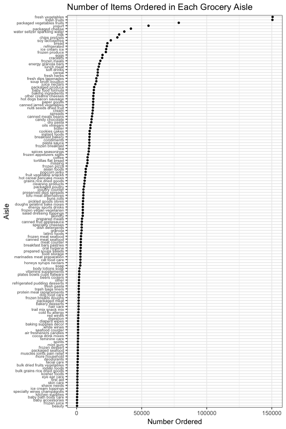

Homework 3
================
Sarah Vititoe
10/13/2018

#### Problem 1

*"This problem uses the BRFSS data. DO NOT include this dataset in your local data directory; instead, load the data from the p8105.datasets package.*

*First, do some data cleaning:*

*format the data to use appropriate variable names;* *focus on the “Overall Health” topic* *include only responses from “Excellent” to “Poor”* *organize responses as a factor taking levels ordered from “Excellent” to “Poor”"*

``` r
brfss <- p8105.datasets::brfss_smart2010 %>%
  janitor::clean_names() %>%
  filter(topic == "Overall Health") %>%
  mutate(response = factor(response, levels = c("Excellent", "Very good", "Good", "Fair", "Poor")))
```

*"Using this dataset, do or answer the following (commenting on the results of each):"* *"In 2002, which states were observed at 7 locations?"*

``` r
brfss %>% 
  select(State = locationabbr, locationdesc) %>% 
  group_by(State) %>% 
  distinct() %>% 
  tally() %>%
  filter(n == 7) %>%
  select(-n) %>%
  knitr::kable()
```

| State |
|:------|
| CT    |
| MT    |
| NH    |
| NM    |
| OR    |
| TN    |
| UT    |

States with 7 sites include Conneticut, Montana, New Hampshire, New Mexico, Oregon, Tennessee, and Utah.

*"Make a “spaghetti plot” that shows the number of locations in each state from 2002 to 2010."*

``` r
brfss %>%
  select(year, locationabbr, locationdesc) %>%
  group_by(locationabbr, year) %>% 
  distinct() %>% 
  tally %>% 
  ggplot(aes(y = n, x = year, group = locationabbr)) + 
    geom_point(alpha = 0.3) + 
    geom_line(alpha = 0.3) + 
    labs(
      title = "(Fig. 1) Number of Locations in Each State and DC from 2002 to 2010", 
      y = "Number of Locations",
      x = "Year"
    ) +
    theme_bw() + 
    theme(legend.position = "bottom") 
```


It seems as if most states have relatively constant numbers of sites over the years, or slightly increase as time goes on, with the exception of one spike for a state in 2007, and another spike in 2010.

*"Make a table showing, for the years 2002, 2006, and 2010, the mean and standard deviation of the proportion of “Excellent” responses across locations in NY State."*

##### Table 1: Excellent Responses Across Locations in New York State

``` r
brfss %>% 
  filter(year %in% c(2002, 2006, 2010), 
         response == "Excellent", 
         locationabbr == "NY") %>% 
  separate(locationdesc, into = c("delete", "Site"), sep = "-") %>% 
  select(Site, data_value) %>%
  group_by(Site) %>%
  summarise("Average Proportion" = round(mean(data_value, na.rm = TRUE), 2),
            "Standard Deviation" = round(sd(data_value, na.rm = TRUE),2)) %>% 
  knitr::kable()
```

| Site                 |     Average Proportion|                          Standard Deviation|
|:---------------------|----------------------:|-------------------------------------------:|
| Bronx County         |                  17.60|                                          NA|
| Erie County          |                  17.20|                                          NA|
| Kings County         |                  20.37|                                        1.77|
| Monroe County        |                  22.40|                                          NA|
| Nassau County        |                  24.93|                                        2.82|
| New York County      |                  27.50|                                        1.54|
| Queens County        |                  19.63|                                        1.36|
| Suffolk County       |                  24.10|                                        3.28|
| Westchester County   |                  26.45|                                        0.64|
| For some counties, a |  standard deviation is|  not calculated due to a small sample size.|

*"For each year and state, compute the average proportion in each response category (taking the average across locations in a state)."*

##### Table 2: Average Proportion of Responses for Each Category of Overall Health

Note: I wasn't sure if you wanted this table in addition to the plot. I included it just in case, but set echo to FALSE, since it is very, very long.

*"Make a five-panel plot that shows, for each response category separately, the distribution of these state-level averages over time."*

``` r
brfss %>%
  select(locationabbr, year, response, data_value) %>% 
  mutate(year = as.factor(year)) %>% 
  group_by(locationabbr, year, response) %>%
  summarise(state_avg = round(mean(data_value, na.rm = TRUE), 2)) %>% 
  ggplot(aes(x=state_avg, y=year, fill = ..x..)) +
    ggridges::geom_density_ridges_gradient(scale = 1) + 
    viridis::scale_fill_viridis(
      option = "inferno", 
      name = "Percent") +
    facet_grid(cols = vars(response)) +
  labs(
      title = "(Fig. 2) State-Level Average Overall Health, From 2002 - 2010", 
      y = "Year",
      x = "Percent of Responses (State Average)"
    ) +
    theme_bw() + 
    theme(legend.position = "bottom") 
```

    ## Picking joint bandwidth of 1.06

    ## Picking joint bandwidth of 1.22

    ## Picking joint bandwidth of 0.981

    ## Picking joint bandwidth of 0.793

    ## Picking joint bandwidth of 0.376


#### Problem 2

*"This problem uses the Instacart data. DO NOT include this dataset in your local data directory; instead, load the data from the p8105.datasets package (it’s called instacart)."*

``` r
instacart <- p8105.datasets::instacart
```

"*The goal is to do some exploration of this dataset. To that end, write a short description of the dataset, noting the size and structure of the data, describing some key variables, and giving illstrative examples of observations."*

``` r
glimpse(instacart)
```

    ## Observations: 1,384,617
    ## Variables: 15
    ## $ order_id               <int> 1, 1, 1, 1, 1, 1, 1, 1, 36, 36, 36, 36,...
    ## $ product_id             <int> 49302, 11109, 10246, 49683, 43633, 1317...
    ## $ add_to_cart_order      <int> 1, 2, 3, 4, 5, 6, 7, 8, 1, 2, 3, 4, 5, ...
    ## $ reordered              <int> 1, 1, 0, 0, 1, 0, 0, 1, 0, 1, 0, 1, 1, ...
    ## $ user_id                <int> 112108, 112108, 112108, 112108, 112108,...
    ## $ eval_set               <chr> "train", "train", "train", "train", "tr...
    ## $ order_number           <int> 4, 4, 4, 4, 4, 4, 4, 4, 23, 23, 23, 23,...
    ## $ order_dow              <int> 4, 4, 4, 4, 4, 4, 4, 4, 6, 6, 6, 6, 6, ...
    ## $ order_hour_of_day      <int> 10, 10, 10, 10, 10, 10, 10, 10, 18, 18,...
    ## $ days_since_prior_order <int> 9, 9, 9, 9, 9, 9, 9, 9, 30, 30, 30, 30,...
    ## $ product_name           <chr> "Bulgarian Yogurt", "Organic 4% Milk Fa...
    ## $ aisle_id               <int> 120, 108, 83, 83, 95, 24, 24, 21, 2, 11...
    ## $ department_id          <int> 16, 16, 4, 4, 15, 4, 4, 16, 16, 7, 16, ...
    ## $ aisle                  <chr> "yogurt", "other creams cheeses", "fres...
    ## $ department             <chr> "dairy eggs", "dairy eggs", "produce", ...

This dataset contains 1384617 observations and 15 variables, representing 131209 orders, 39123 products, and 131209 users. We have information regarding the product, such as it's name, it's aisle location and department, whether it has been reordered, and the order in which it was added to a customer's shopping cart. We also know some information about the shopper, such as how many orders they have places, the days since their previous order, and the day of the week and time they placed their order. The data seems fairly tidy, though a data dictionary might be necessary to decode some of these variables.

*"Then, do or answer the following (commenting on the results of each):*

*How many aisles are there, and which aisles are the most items ordered from?"*

There are 134 aisles. The aisle with the most items ordered from it is the fresh vegetables aisle, with 150609 items ordered from it.

*"Make a plot that shows the number of items ordered in each aisle. Order aisles sensibly, and organize your plot so others can read it."*

``` r
instacart %>%
  group_by(aisle) %>% 
  summarise(count = n()) %>%
  arrange(desc(count)) %>% 
  ggplot(., aes(x = count, y = reorder(aisle, count))) + 
    geom_point(size = 1) + 
    labs(
        title = "Number of Items Ordered in Each Grocery Aisle",
        x = "Number Ordered", 
        y = "Aisle"
    ) +
    theme_bw() + 
    theme(axis.text.y = element_text(size = 6))
```



We can see that we have very skewed data here. Our top 2 observatiosn are fresh vegetables and fresh fruits, which have hadover 150,000 ordered items from those isles. There are very few that have over 50,000 orders.

*"Make a table showing the most popular item in each of the aisles “baking ingredients”, “dog food care”, and “packaged vegetables fruits”."*

``` r
instacart %>%
  filter(aisle %in% c("baking ingredients", "dog food care", "packaged vegetables fruits")) %>%
  select(aisle, product_name) %>% 
  group_by(aisle, product_name) %>% 
  summarise(count = n()) %>% 
  top_n(1) %>% 
  select(-count) %>%
  rename(Aisle = aisle, 
         `Most Popular Product` = product_name) %>% 
  knitr::kable()
```

    ## Selecting by count

| Aisle                      | Most Popular Product                          |
|:---------------------------|:----------------------------------------------|
| baking ingredients         | Light Brown Sugar                             |
| dog food care              | Snack Sticks Chicken & Rice Recipe Dog Treats |
| packaged vegetables fruits | Organic Baby Spinach                          |

People seem to love ordering their organic baby spinach, and light brown sugar from instacart, and buy lots of snack sticks for their good doggos.

*"Make a table showing the mean hour of the day at which Pink Lady Apples and Coffee Ice Cream are ordered on each day of the week; format this table for human readers (i.e. produce a 2 x 7 table)."*

``` r
instacart %>%
  filter(product_name %in% c("Pink Lady Apples", "Coffee Ice Cream")) %>% 
  group_by(product_name, order_dow) %>% 
  summarise(avg = floor(mean(order_hour_of_day, na.rm = TRUE))) %>% 
  mutate(order_dow = factor(order_dow, levels=0:6,
                      labels = c("Sunday", "Monday", "Tuesday", "Wednesday",
                               "Thursday", "Friday", "Saturday"))) %>% 
  spread(key = order_dow, value = avg) %>% 
  select(Product = product_name, Monday:Saturday, Sunday) %>% 
  knitr::kable()
```

| Product          |  Monday|  Tuesday|  Wednesday|  Thursday|  Friday|  Saturday|  Sunday|
|:-----------------|-------:|--------:|----------:|---------:|-------:|---------:|-------:|
| Coffee Ice Cream |      14|       15|         15|        15|      12|        13|      13|
| Pink Lady Apples |      11|       11|         14|        11|      12|        11|      13|

Coffee Icecream seems to be ordered in the afternoon, while pink lady apples are ordered in the morning.

#### Problem 3

*"This problem uses the NY NOAA data. DO NOT include this dataset in your local data directory; instead, load the data from the p8105.datasets package (it’s called ny\_noaa).*"

``` r
noaa <- p8105.datasets::ny_noaa

glimpse(noaa)
```

    ## Observations: 2,595,176
    ## Variables: 7
    ## $ id   <chr> "US1NYAB0001", "US1NYAB0001", "US1NYAB0001", "US1NYAB0001...
    ## $ date <date> 2007-11-01, 2007-11-02, 2007-11-03, 2007-11-04, 2007-11-...
    ## $ prcp <int> NA, NA, NA, NA, NA, NA, NA, NA, NA, NA, NA, NA, NA, NA, N...
    ## $ snow <int> NA, NA, NA, NA, NA, NA, NA, NA, NA, NA, NA, NA, NA, NA, N...
    ## $ snwd <int> NA, NA, NA, NA, NA, NA, NA, NA, NA, NA, NA, NA, NA, NA, N...
    ## $ tmax <chr> NA, NA, NA, NA, NA, NA, NA, NA, NA, NA, NA, NA, NA, NA, N...
    ## $ tmin <chr> NA, NA, NA, NA, NA, NA, NA, NA, NA, NA, NA, NA, NA, NA, N...

*"The goal is to do some exploration of this dataset. To that end, write a short description of the dataset, noting the size and structure of the data, describing some key variables, and indicating the extent to which missing data is an issue. "*"

Our NOAA dataset has 2595176 observations, and 7 variables. For each date of weather recoreded, we have the station ID, precipitation measurements, snowfall, snowdepth, and both the high and low temperatures that day.

*"Then, do or answer the following (commenting on the results of each):Do some data cleaning. Create separate variables for year, month, and day. Ensure observations for temperature, precipitation, and snowfall are given in reasonable units. *"

``` r
noaa <- noaa %>% 
  rename(date_ = date) %>% 
  separate(., col = date_, into = c("year", "month", "day"), sep = "-") %>% 
  mutate_at(vars(prcp:tmin), as.numeric)
```

``` r
noaa %>%
  summarise_at(vars(prcp:tmin), funs(min(., na.rm = TRUE), max(., na.rm = TRUE), median(., na.rm = TRUE), mean(., na.rm = TRUE))) %>%
  knitr::kable()
```

|  prcp\_min|  snow\_min|  snwd\_min|  tmax\_min|  tmin\_min|  prcp\_max|  snow\_max|  snwd\_max|  tmax\_max|  tmin\_max|  prcp\_median|  snow\_median|  snwd\_median|  tmax\_median|  tmin\_median|  prcp\_mean|  snow\_mean|  snwd\_mean|  tmax\_mean|  tmin\_mean|
|----------:|----------:|----------:|----------:|----------:|----------:|----------:|----------:|----------:|----------:|-------------:|-------------:|-------------:|-------------:|-------------:|-----------:|-----------:|-----------:|-----------:|-----------:|
|          0|        -13|          0|       -389|       -594|      22860|      10160|       9195|        600|        600|             0|             0|             0|           150|            33|    29.82324|    4.987025|    37.31228|    139.7984|    30.28537|

Looking at these numbers, I don't like some of the units we have to work with. I'm going to ocnvert them into easier to understand units.

``` r
noaa <- noaa %>% 
  mutate(prcp_cm = prcp/100, # were in tenths of a mm, converting to cm
        snow_cm = snow/10, # convert from mm to cm 
        snwd_cm = snwd/10, # convert from mm to cm 
        tmin_c = tmin/10, # were in tenths of a degree C
        tmax_c = tmax/10) %>% 
  select(id:day, prcp_cm:tmax_c)# were in tenths of a degree C
```

Let's re-run our summarise function to make sure this worked liked I expected it to.

``` r
noaa %>%
  summarise_at(vars(prcp_cm:tmin_c), funs(min(., na.rm = TRUE), max(., na.rm = TRUE), median(., na.rm = TRUE), mean(., na.rm = TRUE))) %>%
  knitr::kable()
```

|  prcp\_cm\_min|  snow\_cm\_min|  snwd\_cm\_min|  tmin\_c\_min|  prcp\_cm\_max|  snow\_cm\_max|  snwd\_cm\_max|  tmin\_c\_max|  prcp\_cm\_median|  snow\_cm\_median|  snwd\_cm\_median|  tmin\_c\_median|  prcp\_cm\_mean|  snow\_cm\_mean|  snwd\_cm\_mean|  tmin\_c\_mean|
|--------------:|--------------:|--------------:|-------------:|--------------:|--------------:|--------------:|-------------:|-----------------:|-----------------:|-----------------:|----------------:|---------------:|---------------:|---------------:|--------------:|
|              0|           -1.3|              0|         -59.4|          228.6|           1016|          919.5|            60|                 0|                 0|                 0|              3.3|       0.2982324|       0.4987025|        3.731228|       3.028537|

*"For snowfall, what are the most commonly observed values? Why?"* The most commonly observed value was 0, 2008508. This is probably because it doesn't snow most days of the year.

Make a two-panel plot showing the average max temperature in January and in July in each station across years. Is there any observable / interpretable structure? Any outliers? Make a two-panel plot showing (i) tmax vs tmin for the full dataset (note that a scatterplot may not be the best option); and (ii) make a plot showing the distribution of snowfall values greater than 0 and less than 100 separately by year.
